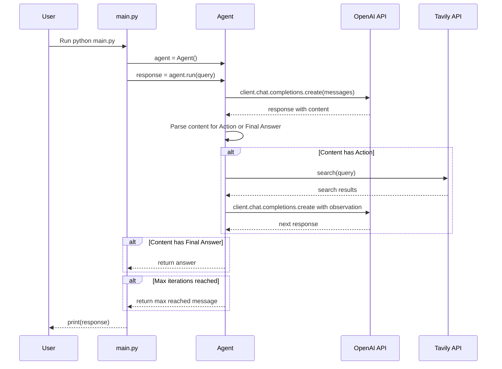

# Control Flow Graph

```mermaid
flowchart TD
    A[Start] --> B[Initialize Agent: create OpenAI client, set model, max_iterations]
    B --> C[Call agent.run(query)]
    C --> D{Iteration < 5}
    D -->|Yes| E[Send messages to OpenAI API]
    E --> F[Receive response content]
    F --> G{Content contains 'Action:'?}
    G -->|Yes| H[Parse action string]
    H --> I{Action is search?}
    I -->|Yes| J[Extract query]
    J --> K[Call search(query)]
    K --> L[Get observation from Tavily]
    L --> M[Append observation to messages]
    M --> D
    I -->|No| N[Append 'Unknown action' to messages]
    N --> D
    G -->|No| O{Content contains 'Final Answer:'?}
    O -->|Yes| P[Extract and return answer]
    O -->|No| D
    D -->|No| Q[Print 'Limit of reasoning 5 loops complete']
    Q --> R[Return 'Max iterations reached']
```

# Runtime Graph



# Variables Summary

## Agent Class Variables
- `self.client`: OpenAI client instance for API calls
- `self.model`: String, the LLM model name ("gemini-2.5-flash-lite")
- `self.max_iterations`: Integer, maximum number of reasoning loops (5)

## run() Method Variables
- `system_prompt`: String, the system prompt with instructions and few-shot examples
- `messages`: List of dictionaries, conversation history with roles and content
- `iteration`: Integer, current loop iteration (0 to 4)
- `response`: OpenAI API response object
- `content`: String, the text content from the LLM response
- `lines`: List of strings, content split by newlines
- `action_line`: String, the line containing "Action:"
- `action_str`: String, the action command after "Action:"
- `start`: Integer, index of first quote in query
- `end`: Integer, index of second quote in query
- `query_search`: String, the extracted search query
- `observation`: String, the result from the search tool

## tools.py Variables
- `client`: TavilyClient instance
- `results`: Dictionary, search results from Tavily
- `formatted_results`: String, formatted search results

## main.py Variables
- `agent`: Agent instance
- `query`: String, the user query
- `response`: String, the final response from agent